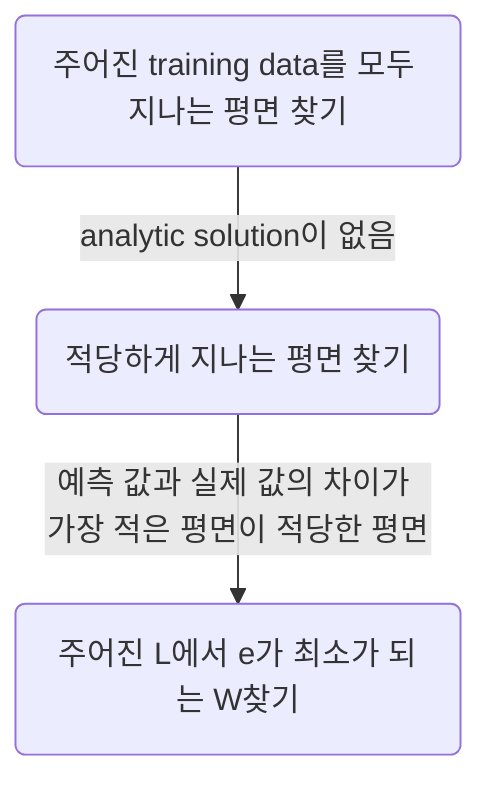

# Regression의 정의

- 여러 개의 **X**(:vector)를 하나의 **y**(:scalar)로 대응시켜주는 관계 **f**(:regressor)를 찾는 것 cf)classication 모델에서 f는 classifier
- 주어진 데이터를 통해 특정 값을 예측하는 방법  cf)값 자체가 아닌 단순 비교 문제는 분류가 됨
# Model

- model = 관계 f (model은 우리가 정한다)
	- g : polynomial regressor(=regression)
		$g(x)=ax^4+bx^3+cx^2+dx+e=y$
	- f : linear regressor(=regression)
		$f(x)=ax+b=y$
		cf)분류 : $ax+b+y=0$
		
		=> 연립 1차 방정식을 푸는 문제가 됨
## Linear Regression

### 1.1.예측 값을 구하는 방법

=> 주어진 training data를 모두 지나는 평면 찾기
### 1.2.예측 값의 정확도
- **Loss function** : 예측 값과 실제 값의 차이인 loss function을 통해 정확도를 알 수 있음
	- L : W-------->e
	- SSE(Sum-of-squared error)
		- $L(W)=\displaystyle \sum_i^N (y_i-\hat y)^2=\displaystyle \sum_i^N (y_i-f(x_{i1},x_{i2}))^2=\displaystyle \sum_i^N (y_i-(w_{i1}x_{i1}+\dots +w_0))^2$
		- 제곱하는 이유 : 단순히 더하기만 하면 음수 값과 양수 값이 상쇄되어 오차를 알 수 없음. 절댓값으로 구할 수도 있지만, 미분하기 어렵기 때문에 제곱을 함.
		- SSE vs MSE
			- MSE : 개수가 늘어남에 따라 발생되는 효과를 n으로 나누어 상쇄시킴 ->여러 데이터끼리 비교할 때 사용
			-  SSE : 최솟값을 구할 때는 굳이 개수에 의해 발생되는 효과를 고려할 필요 없음
- loss function=objective function=cost function=utility function
### 2.Purpose of the Linear regression task

수학적 해가 없음=$\nexists$ 역행렬
### 3.학습 원리
[Link](https://www.researchgate.net/figure/a-ResNets-loss-surface-on-local-minima-in-parameter-space-has-wide-and-flat-geometry_fig1_328015994)
- Loss Space : Loss function이 만드는 공간
	- $e=aw^2+bw+c$ : 계수에 x가 들어있으므로 데이터에 의해 결정됨
	- $L(W)=0 \Leftrightarrow \forall y_i=\hat y_i$ : 데이터가 linear하지 않으면, 0이 될 수 없다.
	
- Loss의 최솟값을 찾는 방법
	1. $L'(W)=0$인 지점(analytic solution)
		- $\frac{\partial L}{\partial W}$: L에 대한 W의 영향. W에 의한 L의 변율
		- ex)$L=L(w_1,w_0)$일 때 $\frac{\partial L}{\partial w_1}=0,\frac{\partial L}{\partial w_0}=0$의 해
			$w_1=\frac{\displaystyle \sum^N_i(x_iy_i+w_0x_i)} {\displaystyle \sum^N_i x_i^2}$ , $w_0=\displaystyle \sum^N_i(x_iw_1-y_i)$ 
			(x,y값이 주어지면, linear한 데이터가 아니라도 구할 수 있음)
	2. Gradient Descent Algorithm : 어느 지점(보통 표준 정규 분포로 결정)을 정한 후, 기울기가 가장 큰 방향으로 내려가는 방법
		>[!definition]
		> $W^t-\nabla W\alpha \rightarrow W^{t+1}$
		>  - learning rate, step size($\alpha$) : 한 번에 얼마나 내려가는지 결정. 너무 크게 설정하면 overshooting됨(deep learning에서는 매우 중요한 factor)
		>  - $-\nabla W\alpha$ : 가장 가파르게 '증가'하는 방향이므로 빼준다? me)이해 안 됨
		- 고차원 공간에서는 $L'(W)=0$가 최소가 아니다.(deterministic하게 찾을 수 없음)
		- Gradient Descent만으로는 local minima만 찾을 수 있음 $\rightarrow$ 점프 시켜서 반복해보는 방식으로 global minima를 찾음
		- ex)$L=L(w_1,w_2,w_0)$일 때 $\frac{\partial L}{\partial w_1}=t_{11}w_1+t_{12},\frac{\partial L}{\partial w_2}=t_{21}w_2+t_{22},\frac{\partial L}{\partial w_0}=w_0+t_{02}$
		=>Gradient Descent Algorithm : $W^{t+1}=W^{t}_1-\alpha (t_1w+t_2)$
		$t_{ij}$ : **데이터 N개 전체**에 대한 식
- Linear regression에서 학습의 정의 : SSE가 최소가 되는 W 찾기
	- T : linear regression
	- P : SSE
	- E : Gradient Descent Algorithm
## Logistic Regression
![[3.Regression  _3.excalidraw]]
- Logistic Regression : 분류 모델
	- 선형회귀선은 loss가 큼 -> logit function 적용
	- $g=\frac{1}{1+e^{-Z}}, Z=wx+b=f(x)$ : 선형 함수를 구긴 것
	- y=g(f(x)) : class 1이 될 확률
		- $g(x)\geq 0.5 \rightarrow \hat y=1$
		- $g(x)<0.5\rightarrow \hat y=0$
	- loss function : $y'=g'(f(x))\cdot f'(x)$